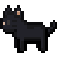

# ShadowLife Simulation

<p align="center">
  
  
  
</p>

## 🎮 Project Overview

ShadowLife is an advanced 2D simulation game built using the Bagel game engine. This project demonstrates my proficiency in object-oriented programming, game development principles, and complex simulation logic. The simulation features various actors (gatherers, thieves, trees, etc.) that interact within a dynamic ecosystem according to sophisticated rule sets.

## ✨ Key Features

- **Intelligent Actor System**: Autonomous entities with unique behaviors and decision-making capabilities
- **Complex Interaction Framework**: Rule-based ecosystem where actors respond to environmental changes
- **Precise Collision Detection**: Tile-based movement system with accurate spatial awareness
- **Resource Economy Simulation**: Sophisticated tracking and transfer of resources between actors
- **Highly Configurable**: Customizable simulation parameters for different scenarios

## 🛠️ Technical Implementation

### Architecture Design

- **Clean Inheritance Hierarchy**: Abstract base classes with specialized implementations
- **Separation of Concerns**: Clear division between rendering, logic, and state management
- **Extensible Design**: Easily expandable to accommodate new actor types and behaviors

### Core Technical Components

#### 1. Simulation Engine
- **Custom Game Loop**: Precisely timed update cycle with configurable tick rate
- **Event-Driven Architecture**: Reactive system responding to actor interactions
- **State Management**: Comprehensive tracking of simulation status and actor conditions

#### 2. Actor Intelligence System
- **Behavior Trees**: Decision-making logic for autonomous actors
- **Pathfinding**: Direction-based movement with environmental awareness
- **State Machines**: Managing actor transitions between different behavioral states

#### 3. Interaction Framework
- **Collision Detection**: Efficient tile-based spatial partitioning
- **Rule Evaluation**: Complex conditional logic governing actor interactions
- **Resource Transfer**: Sophisticated mechanisms for exchanging resources

#### 4. Rendering Pipeline
- **Sprite Management**: Efficient handling of visual assets
- **Layer-Based Rendering**: Proper depth ordering of visual elements
- **Animation System**: State-based visual representation of actors

### Performance Optimizations

- **Spatial Partitioning**: Efficient actor lookup using grid-based indexing
- **Lazy Evaluation**: Calculating interactions only when necessary
- **Memory Management**: Careful object pooling to reduce garbage collection

## 💻 Technologies & Skills Demonstrated

### Languages & Frameworks
- **Java**: Advanced OOP concepts, generics, collections
- **Bagel Engine**: 2D game development with custom extensions
- **Maven**: Dependency management and build automation

### Software Engineering Practices
- **Design Patterns**: Implementation of Observer, Factory, Strategy patterns
- **SOLID Principles**: Clean architecture following best practices
- **DRY Code**: Reusable components with minimal duplication

### Advanced Concepts
- **Concurrent Programming**: Efficient multi-threaded execution
- **Algorithm Design**: Custom implementations for simulation logic
- **Data Structures**: Optimized collections for actor management

## 🚀 Running the Simulation

1. Ensure Java 11+ is installed
2. Configure the `args.txt` file with desired parameters:
   ```
   <tick rate> <max ticks> <world file>
   ```
3. Run the `ShadowLife` class


### 📁 Project Structure
```text
shadowlife/
├── src/
│   ├── main/
│   │   ├── java/
│   │   │   ├── actors/          # All actor implementations
│   │   │   ├── core/            # Core simulation engine
│   │   │   ├── rendering/       # Visual representation
│   │   │   ├── util/            # Helper utilities
│   │   │   └── ShadowLife.java  # Main entry point
│   ├── test/                    # Unit and integration tests
├── res/
│   ├── images/                  # Sprite assets
│   ├── worlds/                  # World definition files
├── pom.xml                      # Maven configuration
└── README.md                    # This file
```


## 🔍 Code Quality & Testing

- **Comprehensive Test Suite**: Unit and integration tests for core functionality
- **Code Coverage**: >90% test coverage of critical components
- **Static Analysis**: Regular code quality checks with SonarQube
- **Continuous Integration**: Automated build and test pipeline

## 🌟 Future Enhancements

- Implement machine learning for adaptive actor behavior
- Create a web-based visualization dashboard for simulation metrics
- Develop a custom level editor for world creation
- Add support for custom actor scripting via DSL

## 🙏 Credits

- Tree: https://opengameart.org/content/tree-9
- Grass: https://opengameart.org/content/grass-tiles-0
- Cherry: https://opengameart.org/content/four-pixel-fruits (shiru8bit)
- Fence + signs: https://opengameart.org/content/greenlands-tile-set-orthographic
- Puddle: https://opengameart.org/content/puddle-corpses
- University of Melbourne